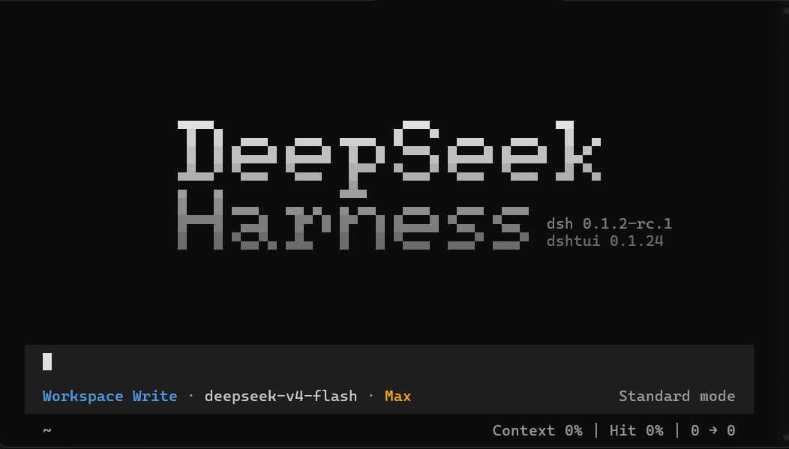

# dshtui

[English](README.md) | 中文

<p align="center">
  
</p>

`dshtui` 是 [DeepSeek Harness](https://github.com/deepseek-ai/deepseek-harness)（`dsh`）的终端界面插件，基于 [Ink](https://github.com/vadimdemedes/ink) 渲染，opencode的tui风格。它以 bundle 插件形式挂载进 dsh profile，接管整个终端界面：流式对话、可折叠的工具卡片、各类对话框，以及覆盖全部可见表面的插件贡献 API。

本项目作为 deepseek harness 的插件存在。

## 环境要求

- Node.js `^22.19.0` 或 `>=24.0.0`
- `dsh` CLI：`npm install -g @deepseek-ai/dsh`

## 安装

```sh
npm install -g @xp266/dshtui@latest
dshtui
```

`dshtui` 会先确定要启动的 profile（`DSH_TUI_PROFILE` 优先；否则依次使用 `dshtui` profile、已挂载本包的既有 profile，都没有则新建），在其中安装或升级本插件，然后以 `dsh --profile <name>` 启动。

也可以不用启动器，手动装入任意 profile：

```sh
dsh plugin --profile <name> add @xp266/dshtui@latest
dsh --profile <name>
```

## 配置

插件从 profile 中对应的条目读取配置：

```yaml
- id: tui
  name: '@xp266/dshtui'
  config:
    colors: {}            # 调色板覆盖（颜色名 -> 十六进制色值）
    maxFps: 240
    bootListTimeout: 10000
    alternateScreen: true
    collapse:             # 工具卡片折叠策略
      maxLines: 16        # 渲染行数超过此值的正文默认折叠
      previewLines: 8     # 折叠时保留的预览行数
      folded: []          # 强制折叠的工具名列表
      expanded: []        # 永不折叠的工具名列表
```

环境变量：`DSH_TUI_PROFILE`、`DSH_TUI_COLOR`、`DSH_TUI_ASCII`、`DSH_TUI_WIDTH`、`DSH_TUI_BG`、`DSH_TUI_HOT_THEME`、`DSH_TUI_THEME_PATH`、`DSH_TUI_DEBUG`，以及 `DSH_TUI_LOG_*` 系列。

## 插件开发

界面的每一个可见表面都是 `tui` 服务背后的键控贡献注册表。完整的贡献点清单见[扩展点指南](docs/plugin-author-guide.zh.md)

## 从源码运行或开发

```sh
git clone https://github.com/xp266/dsh-tui.git
cd dsh-tui
pnpm install
pnpm typecheck
pnpm build
pnpm verify
```

## 许可证

MIT
